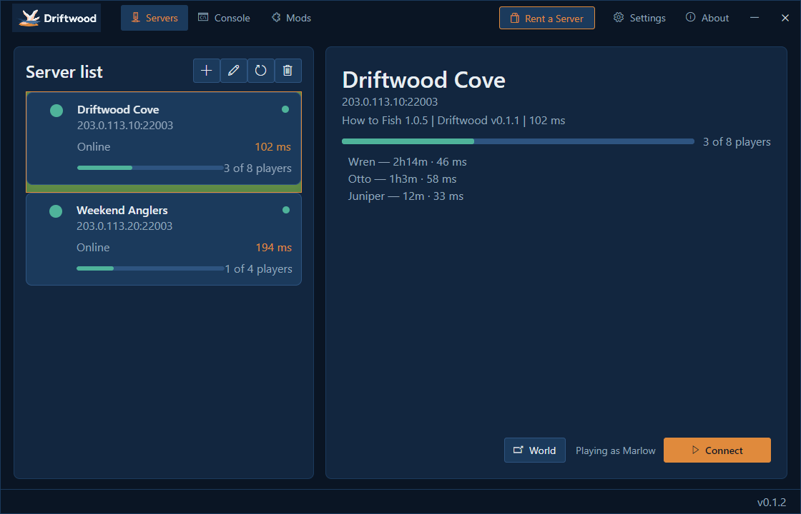
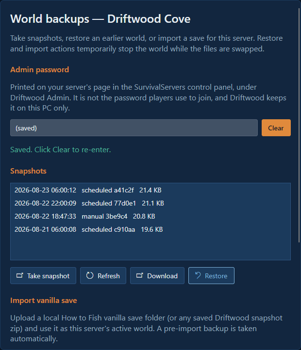
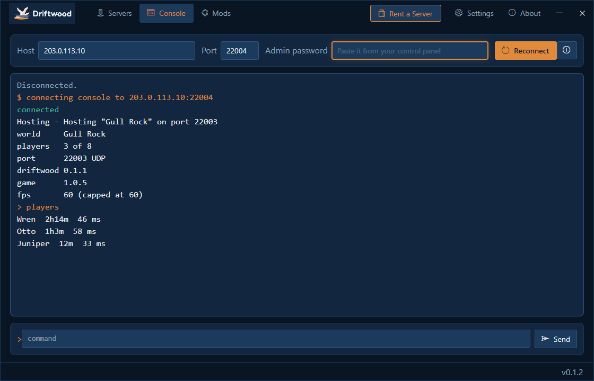

  

# Driftwood

Driftwood gives **How to Fish** always-on dedicated servers: players join through the Driftwood app, hosts run the Driftwood server package next to How to Fish's game files, and the world lives on the server instead of inside one person's game. No waiting for the host to come online, and nobody's PC doing the hosting.

Every player installs Driftwood to join a Driftwood server, the host included: How to Fish has no dedicated servers of its own, so the app is how anyone gets in. It installs once per person and takes a minute. Your copy of How to Fish is bought, launched and updated through Steam exactly as normal; Driftwood replaces nothing and ships no part of the game.

  

## Features

### 🌊 Your world never sleeps
The world lives on the server, not on anyone's PC. One of you fishes at noon, another at midnight, and the same world is waiting for both. When the last player logs off the server keeps running and keeps saving.

### 🧭 Join by address
Save a server's address once. From then on the app shows whether it is up and who is on it, and joining is one click: **Connect** readies How to Fish and takes you straight in.

### 🧑‍🤝‍🧑 Up to eight players
The full co-op limit How to Fish supports, with nobody's machine doing the hosting. The limit is applied before the server opens its door rather than after, so a full server turns players away cleanly instead of half-admitting them.

### 🚦 Refuses to run broken
The server resolves everything it needs to patch **before** it patches anything, counts what it actually changed, and refuses to host if a single required piece has moved. A game update that breaks it produces one plain sentence naming what failed, not a server that boots, opens a port and hosts nothing.

### 🩺 Honest status
A server reports ready only once the world is genuinely running, not merely once the port is open: the gameplay port binds before the world exists, so "the process answered" is equally true of a server whose entire mod stack failed. An unknown player count is reported as unknown and never rounded down to zero.

### 💾 Backups that are actually consistent
The server is told to save and the save is confirmed on disk before a snapshot is taken, so a backup is a whole world rather than whatever happened to be written when the copy started.

  

### 🖥️ An admin console built in
Server owners sign in with their admin password and drive the server from the Console tab: status, players, saves, snapshots. No extra tools, no separate RCON client.

  

### 🪶 Light on the machine
One server is a single game process with a small mod inside it and no renderer, so a modest box can host several. The server package adds a few hundred kilobytes on top of How to Fish's own files.

## Install

### Managed hosting
[How to Fish hosting from SurvivalServers.com](https://www.survivalservers.com/services/game_servers/how_to_fish/?utm_source=github&utm_medium=readme_install&utm_campaign=driftwood) comes with Driftwood installed and kept up to date, the ports open, and an address ready to hand to your players.

### Players
1. Download `DriftwoodSetup-<version>.exe` from the [latest release](https://github.com/HumanGenome/Driftwood/releases/latest).
2. Run the installer. It is a one-time install per person.
3. Open Driftwood, add the server address your host gave you, and click **Connect**. The app readies How to Fish and takes you in.

### Self-hosted servers
The walkthrough is [DriftwoodServer's self-hosting guide](https://github.com/HumanGenome/DriftwoodServer/blob/master/docs/self-hosting.md). You will need a Windows machine, a copy of How to Fish's game files on it (from your own Steam copy; the server package ships no part of the game), and an open port.

## Releases

This repo publishes the player side:

- `DriftwoodSetup-<version>.exe`, the installer for players
- Release notes for each version

The server package for hosts lives on the [DriftwoodServer release page](https://github.com/HumanGenome/DriftwoodServer/releases/latest). What changed in the app is in [this repo's release notes](https://github.com/HumanGenome/Driftwood/releases); what changed on the server side is in [DriftwoodServer's CHANGELOG.md](https://github.com/HumanGenome/DriftwoodServer/blob/master/CHANGELOG.md).

## Source

Driftwood is split into two public repos:

- **Driftwood** (this repo): the player side, the desktop app players install, plus the public downloads and documentation.
- **[DriftwoodServer](https://github.com/HumanGenome/DriftwoodServer)**: the dedicated server package hosts run next to How to Fish's game files.

Players only need this repo's releases; hosts run the server from DriftwoodServer's.

## FAQ

### Do all my friends need the app?
Yes, and so do you. How to Fish cannot reach a Driftwood server without it. It installs once per person, and ordinary How to Fish co-op still works whenever you want it.

### Do I need to leave my PC on?
No. That is the entire point. Once the world is on a server, your machine has nothing to do with it.

### Does this change my copy of How to Fish?
No. You buy, run and update How to Fish through Steam as normal, and your ordinary single-player and co-op games are untouched.

### Can I move a world between servers?
Yes. World saves are ordinary files, so a host can copy one across.

### What happens when How to Fish updates?
The server checks the game build it is running against the build it was validated for, and says so rather than guessing. If an update moves something the server depends on, it refuses to host and names what moved. See **Refuses to run broken** above.

### Is this an official How to Fish feature?
No. Driftwood is an independent community project. Dazed Games does not ship dedicated servers for How to Fish, which is why this exists.

### Where do I report a problem?
[Open an issue](https://github.com/HumanGenome/Driftwood/issues). If you rent a managed server, your host handles billing and control-panel questions.

## Contributing

Bug reports and feature requests are welcome; see [CONTRIBUTING.md](CONTRIBUTING.md). Security issues go through [private reporting](.github/SECURITY.md), never a public issue.

## Community Note

Driftwood is a community project and is not affiliated with, endorsed by, or supported by Dazed Games. How to Fish is their game: [buy it on Steam](https://store.steampowered.com/app/4001890/).

## License

MIT. See [LICENSE](LICENSE).

## Credits

- [BepInEx](https://github.com/BepInEx/BepInEx), the Unity modding framework the server side runs on
- [Avalonia](https://avaloniaui.net/), the .NET UI framework used by the Driftwood app
